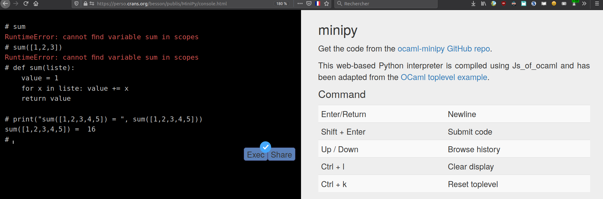
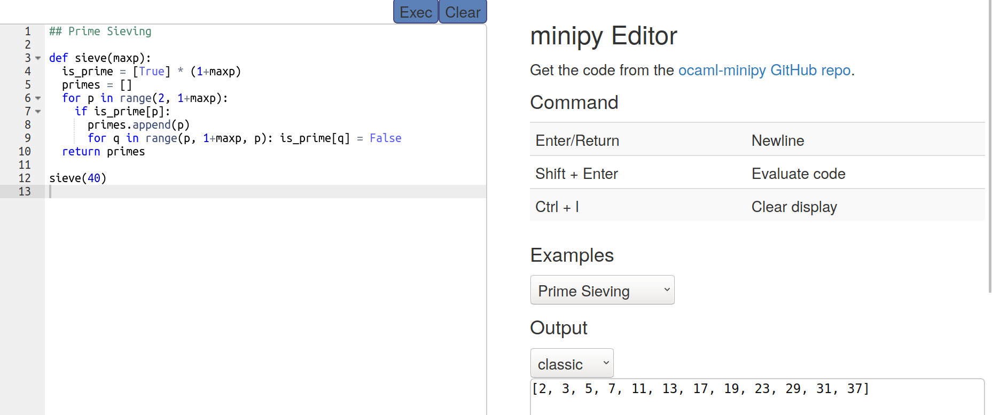
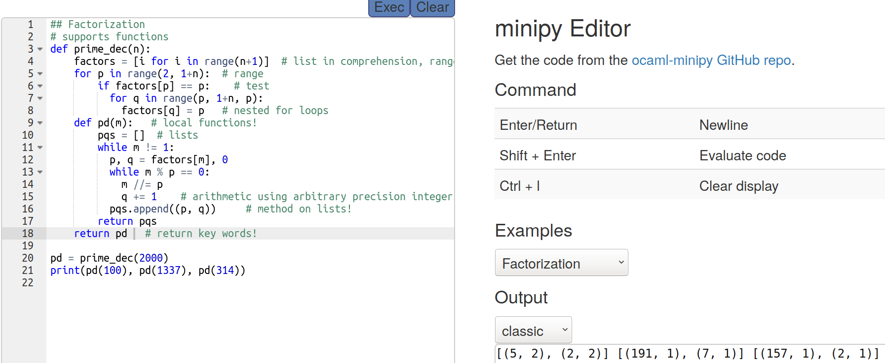

# My local copy of OCaml MiniPy

A Naive (OCaml) interpreter for a (minimalist subset of a) Python like language.

Try the [interpreter](console.html) online or use the [editor](editor.html) (these rely on [js_of_ocaml](https://ocsigen.org/js_of_ocaml/3.5.1/manual/overview)).

This is a work in progress, most of the supported features are only partially implemented.

---

## Screenshots

Here is an example of using the [MiniPy OCaml console](https://perso.crans.org/besson/publis/MiniPy/console.html), to define a `sum` function. It shows that a lot of basic construct of the Python language are supported, but almost no functions from the standard library are available:

Here is a second example, using the [MiniPy OCaml editor](https://perso.crans.org/besson/publis/MiniPy/editor.html), loaded with one of the example files, showing a Eratosthene Sieve to detect prime numbers:

Here is a third and last example, using the [MiniPy OCaml editor](https://perso.crans.org/besson/publis/MiniPy/editor.html), loaded with one of the example files, showing the prime decompositions of integers. I added a few comments (`# blabla`) to show some features supported by MiniPy:

---

## Details about this local copy

### Where is it hosted on my website?

On my websites, it is as <https://perso.crans.org/besson/publis/MiniPy/> and <https://besson.link/publis/MiniPy/>.

### Where do the files come from?

- The source code of MiniPy is from <https://github.com/LaurentMazare/ocaml-minipy/>, and is open-source under Apache-2.0 license ;

- From <https://github.com/LaurentMazare/LaurentMazare.github.io/tree/master/minipy>, this repository has no license information ;

- The CSS use [Bootstrap from Twitter](https://github.com/twbs/bootstrap), which is also open-source under MIT license ;

- The editor is written in javascript and CSS, and it's [ACE](https://ace.c9.io/), and is also open-source under [BSD license](https://github.com/ajaxorg/ace) ;

### License ?
[Apache-2.0 License](https://github.com/LaurentMazare/ocaml-minipy/blob/master/LICENSE)
Copyright 2020 by [LaurentMazare](https://github.com/LaurentMazare/).

----

## Documentation of supported features

See <https://github.com/LaurentMazare/ocaml-minipy#supported-features>

### Supported Features

- Python values:
    - Boolean.
    - Integer (represented with arbitrary precision!).
    - Float.
    - String.
    - List/Tuple.
- Function definitions (with keyword arguments, ...), nested function definition.
- Variable assignments with tuple/list destructuring and assignements to a list element.
- Augmented assignments `+=`, `-=`, etc.
- Control flow:
    - Loops: `while` and `for` loops, with support for `break` and `continue`.
    - If conditionals with `elif` and `else`.
- Expressions:
    - Unary and binary operators, comparisons.
    - Ternary if operator.
    - Attributes, e.g. `x.foo`.
    - Subscripts, e.g. `x[foo]`.
    - Lambdas, `lambda`.
    - List comprehensions (only for lists, no support for dict/set).
- Built-ins `print`, `range`.
- Dictionaries.
- Delete operator, `del`.
- REPL example, javascript version with js-of-ocaml.
- Starred expressions.
- Basic object system.
- Exceptions, `try/with` blocks, `raise`.
- `with` blocks.
- (Class) Inheritance.

### Not implemented yet

- Sets.
- Slices, e.g. `x[12:15]`.
- Generators, `yield`.
- Module system, `import`.
- Type annotations.
- Bytecode compilation/interpreter.
